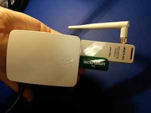

# Connect the Internet of Things with Unix pipes.
> Set up pipes on the command line or use the Piper App to configure the pipes for you. 

### Get The Kit  
<!--img src="images/opk.jpg" style="float:right; clear: none"-->

- [Raspberry Pi 2 Model B](http://www.mcmelectronics.com/content/en-US/raspberry-pi)
- [Raspberry Pi Case](http://www.amazon.com/Official-Raspberry-Foundation-Case-Model/dp/B00ZS26ZJA/ref=sr_1_1?ie=UTF8&qid=1444957520&sr=8-1&keywords=Official+raspberry+pi+2+model+b+case) 
- [Micro SD Card](http://goo.gl/xXPZuX) with [Pirateship for Pi](http://openpipekit.github.io/pirate.sh/#!index.md)
- [USB Power Supply](http://www.microcenter.com/product/441187/Micro-USB_Power_Supply_for_Raspberry_Pi_B_with_Built-in_4ft_Cable_-_2_Amp)
- [A WiFi USB Dongle if you need it](http://www.microcenter.com/product/361805/150Mbps_Wireless_N_USB_Adapter)
- [USB Flash Drive](http://www.microcenter.com/product/281032/16GB_USB_20_Flash_Drive)

### Set up the pipes 

- Check out the [Guides](guides.md) for examples of how to point and click configure pipes, use the command line, and develop for devices and databases not yet supported. 
- Check out the [Piper App](piper-app.md) for a point and click way to connect devices to the Internet. 
- Check out the [Devices and Databases](devices-and-databases.md) that are currently supported. 

### Get involved 
* [Email Forum on Google Groups](https://groups.google.com/forum/#!forum/open-pipe-kit)
* [Live Chat on Gitter](https://gitter.im/openpipekit/openpipekit)
* [Monthly Hangout, first thursday at 8pm ET](https://plus.google.com/hangouts/_/rjsteinert.com/open-pipe-kit)
* [Research Notes tagged on Public Lab](https://publiclab.org/tag/open-pipe-kit)
* [Forum posts tagged on Farm Hack]()
